# Writing Terraform Configuration
When you start writing Terraform configuration, you will notice very quickly that the language provided by Terraform is very rich and allows for a lot of manipulation.

In the recipes in this lab, you will learn how to use the Terraform language effectively in order to apply it to real-life business scenarios. We will discuss how to specify the versions of the provider to be used, as well as how to make the code more dynamic with variables and outputs. Then, we will use these concepts to provision several environments with Terraform. After that, we will consider the use of functions and conditions.

We will also learn how to retrieve data from external systems with data blocks, other Terraform state files, and external resources. Finally, we will cover the use of Terraform for local operations, such as running a local executable and manipulating local files.

In this lab, we will cover the following recipes:

* Configuring Terraform and the provider version to use
* Manipulating variables
* Using local variables for custom functions
* Using outputs to expose Terraform provisioned data
* Provisioning infrastructure in multiple environments
* Obtaining external data with data sources
* Using external resources from other state files
* Querying external data with Terraform
* Calling Terraform built-in functions
* Writing conditional expressions
* Manipulating local files with Terraform
* Executing local programs with Terraform
* Generating passwords with Terraform
Let's get started!

## Technical requirements
For this lab, you will need to have the Terraform binary installed on your computer. The source code for this lab is available at https://github.com/PacktPublishing/Terraform-Cookbook/tree/master/CHAP02.

Check out the following video to see the code in action: https://bit.ly/3hcZNVR

## Configuring Terraform and the provider version to use
The default behavior of Terraform is that, when executing the terraform init command, the version of the Terraform binary (which we will call the Command-Line Interface (CLI), as explained here: https://www.terraform.io/docs/glossary.html#cli) used is the one installed on the local workstation. In addition, this command downloads the latest version of the providers used in the code.

However, for compatibility reasons, it is always advisable to avoid surprises so that you can specify which version of the Terraform binary is going to be used in the Terraform configuration. The following are some examples:

A Terraform configuration written with HCL 2 must indicate that it has to be executed with a Terraform version greater than or equal to 0.12.
A Terraform configuration that contains new features such as count and for_each in modules must indicate that it has to be executed with a Terraform version greater than or equal to 0.13.
For more details about the HCL syntax, read the documentation at https://www.terraform.io/docs/configuration/syntax.html.
In the same vein and for the same reasons of compatibility, we may want to specify the provider version to be used.

In this recipe, we will learn how to specify the Terraform version, as well as the provider version.

### Getting ready
To start this recipe, we will write a basic Terraform configuration file that contains the following code:
```
variable "resource_group_name" {
  default = "rg_test"
}
resource "azurerm_resource_group" "rg" {
  name     = var.resource_group_name
  location = "West Europe"
}
resource "azurerm_public_ip" "pip" {
  name                         = "bookip"
  location                     = "West Europe"
  resource_group_name          = azurerm_resource_group.rg.name
  public_ip_address_allocation = "Dynamic"
  domain_name_label            = "bookdevops"
}
```

This example code provides resources in Azure (a Resource Group and a public IP address). For more details, read the following documentation about the Terraform AzureRM provider: https://www.terraform.io/docs/providers/azurerm/index.html

In addition, this code contains the improvements that were made to the HCL 2.0 language since Terraform 0.12. For more details about these HCL enhancements, go to https://www.slideshare.net/mitchp/terraform-012-deep-dive-hcl-20-for-infrastructure-as-code-remote-plan-apply-125837028.
Finally, when executing the terraform plan command inside this code, we get the following warning message:

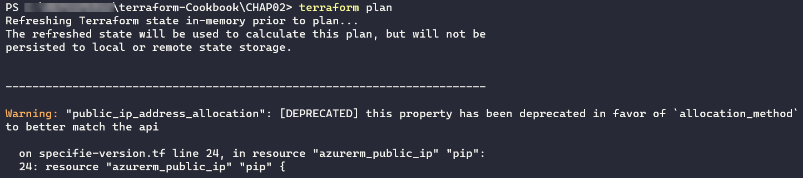

This means that, currently, this Terraform configuration is still compatible with the latest version of the provider but that in a future version of the provider, this property will be changed and therefore this code will no longer work.

Now, let's discuss the steps we need to follow to make the following compliances:

This configuration can only be executed if Terraform 0.13 (at least) is installed on the local computer.
Our current configuration can be executed even if the azurerm provider evolves with breaking changes.
Regarding the new features provided by Terraform 0.13, read the change log here – https://github.com/hashicorp/terraform/blob/master/CHANGELOG.md, and the upgrade guide here – https://github.com/hashicorp/terraform/blob/master/website/upgrade-guides/0-13.html.markdown.
We'll take a look at this next.

### How to do it…
To specify the Terraform version to be installed on the local workstation, do the following:

In the Terraform configuration, add the following block:
```
terraform {
  required_version = ">= 0.13"
}
```

To specify the provider source and version to use, we need to add the required_provider block inside the same terraform configuration block:
```
terraform {
  ...
  required_providers {
    azurerm = {
      source = "hashicorp/azurerm"
      version = "2.10.0"
    }
  }
}
```
### How it works…
When executing the terraform init command, Terraform will check that the version of the installed Terraform binary that executes the Terraform configuration file corresponds to the version specified in the required_version property of the terraform block.

If it matches, it won't throw an error as it is greater than version 0.13. Otherwise, it will throw an error:
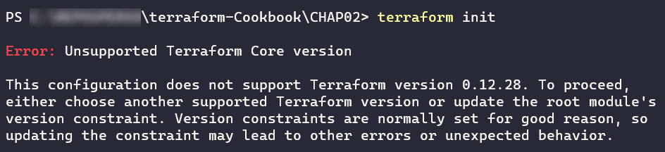

With regard to the specification of the provider version, when executing the terraform init command, if no version is specified, Terraform downloads the latest version of the provider, otherwise it downloads the specified version, as shown in the following two screenshots.

The following screenshot shows the provider plugin being downloaded from the specified source without us specifying the required version (at the time of writing, the latest version of the provider is 2.20.0):
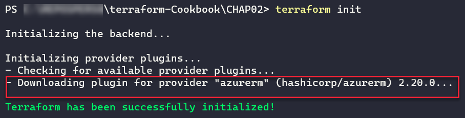

As we can see, the latest version of the azurerm provider (2.20.0) has been downloaded.

In addition, the following screenshot shows the azurerm provider plugin being downloaded when we specify the required version (2.10.0):
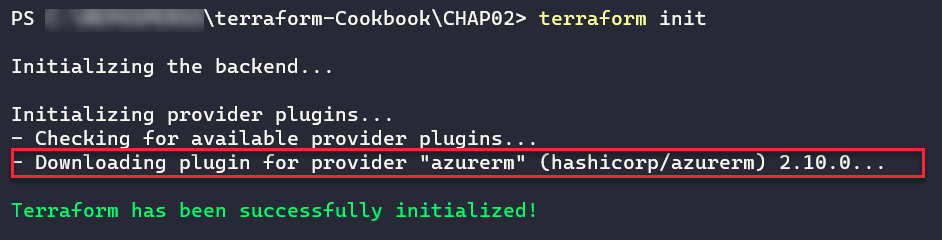

As we can see, the specified version of the azurerm provider (2.10.0) has been downloaded.

For more details about the required_version block and provider versions, go to https://www.terraform.io/docs/configuration/terraform.html#specifying-required-provider-versions.
In this required_version block, we also add the source property, which was introduced in version 0.13 of Terraform and is documented here: https://github.com/hashicorp/terraform/blob/master/website/upgrade-guides/0-13.html.markdown#explicit-provider-source-locations

### There's more…
In this recipe, we learned how to download the azurerm provider in various ways. What we did here applies to all providers you may wish to download.

It is also important to mention that the version of the Terraform binary that's used is specified in the Terraform state file. This is to ensure that nobody applies this Terraform configuration with a lower version of the Terraform binary, thus ensuring that the format of the Terraform state file conforms with the correct version of the Terraform binary.

### See also
For more information about the properties of the Terraform block, go to https://www.terraform.io/docs/configuration/terraform.html.
For more information about the properties of the providers, go to https://www.terraform.io/docs/configuration/providers.html.
More information about Terraform binary versioning is documented at https://www.terraform.io/docs/extend/best-practices/versioning.html.
The upgrade guide for the azurerm provider (to version 2.0) is available at https://www.terraform.io/docs/providers/azurerm/guides/2.0-upgrade-guide.html.

## Manipulating variables
When you write a Terraform configuration file where all the properties are hardcoded in the code, you often find yourself faced with the problem of having to duplicate it in order to reuse it.

In this recipe, we'll learn how to make the Terraform configuration more dynamic by using variables.

### Getting ready
To begin, we are going to work on the main.tf file, which contains a basic Terraform configuration:
```
resource "azurerm_resource_group" "rg" {
  name     = "My-RG"
  location = "West Europe"
}
```
As we can see, the name and location properties have values written in the code in a static way.

Let's learn how to make them dynamic using variables.

### How to do it…
Perform the following steps:

In the same main.tf file, add the following variable declarations:
```
variable "resource_group_name" {
  description ="The name of the resource group"
}
variable "location" {
  description ="The name of the Azure location"
  default ="West Europe"
}
Then, modify the Terraform configuration we had at the beginning of this recipe so that it refers to our new variables, as follows:
resource "azurerm_resource_group" "rg" {
  name     = var.resource_group_name
  location = var.location
}
```

Finally, in the same folder that contains the main.tf file, create a new file called terraform.tfvars and add the following content:
```
resource_group_name = "My-RG"
location            = "westeurope"
```

### How it works…
In step 1, we wrote the declaration of the two variables, which consists of the following elements:

A variable name: This must be unique to this Terraform configuration and must be explicit enough to be understood by all the contributors of the code.
A description of what this variable represents: This description is optional, but is recommended because it can be displayed by the CLI and can also be integrated into the documentation, which is automatically generated.
A default value: This is optional. Not setting a default value makes it mandatory to enter a default value.
Then, in step 2, we modified the Terraform configuration to use these two variables. We did this using the var.<name of the variable> syntax.

Finally, in step 3, we gave values to these variables in the terraform.tfvars file, which is used natively by Terraform.

The result of executing this Terraform configuration is shown in the following screenshot:
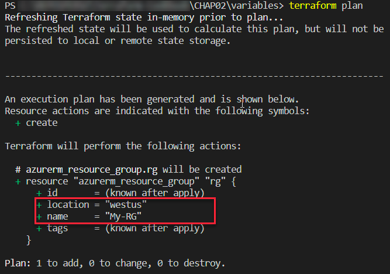

### There's more…
Setting a value in the variable is optional in the terraform.tfvars file since we have set a default value for the variable.

Apart from this terraform.tfvars file, it is possible to give a variable a value using the -var option of the terraform plan and terraform apply commands, as shown in the following command:

terraform plan -var "location=westus"
So, with this command, the location variable declared in our code will have a value of westus instead of westeurope.

In addition, with the 0.13 version of Terraform released in August 2020, we can now create custom validation rules for variables which makes it possible for us to verify a value during the terraform plan execution.

In our recipe, we can complete the location variable with a validation rule in the validation block as shown in the following code:
```
variable "location" {
  description ="The name of the Azure location"
  default ="West Europe"
  validation { # TF 0.13
    condition = can(index(["westeurope","westus"], var.location) >= 0)
    error_message = "The location must be westeurope or westus."
  }
}
```

In the preceding configuration, the rule checks that if the value of the location variable is westeurope or westus.

The following screenshot shows the terraform plan command in execution if we put another value in the location variable, such as westus2:

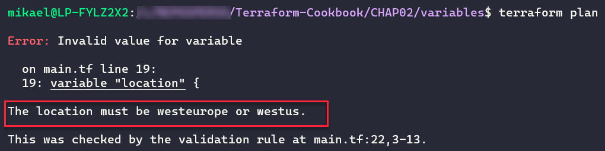
For more information about variable custom rules validation read the documentation at https://www.terraform.io/docs/configuration/variables.html#custom-validation-rules.

Finally, there is another alternative to setting a value to a variable, which consists of setting an environment variable called TF_VAR_<variable name>. As in our case, we can create an environment variable called TF_VAR_location with a value of westus and then execute the terraform plan command in a classical way.

Note that using the -var option or the TF_VAR_<name of the variable> environment variable doesn't hardcode these variable's values inside the Terraform configuration. They make it possible for us to give values of variables to the flight. But be careful – these options can have consequences if the same code is executed with other values initially provided in parameters and the plan's output isn't reviewed carefully.

### See also
In this recipe, we looked at the basic use of variables. We will look at more advanced uses of these when we learn how to manage environments in the Managing infrastructure in multiple environments recipe, later in this lab.

For more information on variables, refer to the documentation here: https://www.terraform.io/docs/configuration/variables.html

## Using local variables for custom functions
In the previous recipe, we learned how to use variables to dynamize our Terraform configuration. Sometimes, this use can be a bit more tedious when it comes to using combinations of variables.

In this recipe, we will learn how to implement local variables and use them as custom functions.

### Getting ready
To start with, we will use the following Terraform configuration:

```
variable "application_name" {
  description = "The name of application"
}
variable "environment_name" {
  description = "The name of environment"
}
variable "country_code" {
  description = "The country code (FR-US-...)"
}
resource "azurerm_resource_group" "rg" {
  name = "XXXX" # VARIABLE TO USE
  location = "West Europe"
}
resource "azurerm_public_ip" "pip" {
  name = "XXXX" # VARIABLE TO USE
  location = "West Europe"
  resource_group_name = azurerm_resource_group.rg.name
  allocation_method = "Dynamic"
  domain_name_label = "mydomain"
}
```
The goal of this recipe is to consistently render the names of the Azure resources. We must provide them with the following nomenclature rule:

CodeAzureResource - Name Application - Environment name - Country Code
### How to do it…
Perform the following steps:

In the main.tf file, which contains our Terraform configuration, we will add a local variable called resource_name, along with the following code:
```
locals {
  resource_name = "${var.application_name}-${var.environment_name}-${var.country_code}"
}
```

We then use this local variable in the resources with the following code:
```
resource "azurerm_resource_group" "rg" {
 name = "RG-${local.resource_name}"
 location = "West Europe"
}
resource "azurerm_public_ip" "pip" {
 name = "IP-${local.resource_name}"
 location = "West Europe"
 resource_group_name = azurerm_resource_group.rg.name
 public_ip_address_allocation = "Dynamic"
 domain_name_label = "mydomain"
}
```

### How it works…
In step 1, we created a variable called resource_name that is local to our Terraform configuration. This allows us to create a combination of several Terraform variables (which we will see the result of in the Using outputs to expose Terraform provisioned data recipe of this lab).

Then, in step 2, we used this local variable with the local.<name of the local variable> expression. Moreover, in the name property, we used it as a concatenation of a variable and static text, which is why we used the "${}" syntax.

The result of executing this Terraform configuration is as follows:

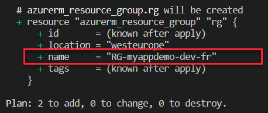
In the previous screenshot, we can see the output of executing the terraform plan command with the name of the Resource Group that we calculated with the locals variable.

### See also
For more information on local variables, take a look at the following documentation: https://www.terraform.io/docs/configuration/locals.html

## Using outputs to expose Terraform provisioned data
When using Infrastructure as Code tools such as Terraform, it is often necessary to retrieve output values from the provisioned resources after code execution.

One of the uses of these output values is that they can be used after execution by other programs. This is often the case when the execution of the Terraform configuration is integrated into a CI/CD pipeline.

For example, we can use these output values in a CI/CD pipeline that creates an Azure App Service with Terraform and also deploys the application to this Azure App Service. In this example, we can have the name of the App Service (web app type) as the output of the Terraform configuration. These output values are also very useful for transmitting information through modules, which we will see in detail in lab 5, Sharing Terraform Configuration with Modules.

In this recipe, we will learn how to implement output values in Terraform's configuration.

### Getting ready
To proceed, we are going to add some Terraform configuration that we already have in the existing main.tf file.

The following is an extract of this existing code, which provides an App Service in Azure:
```
...
resource "azurerm_app_service" "app" {
  name                = "${var.app_name}-${var.environment}"
  location            = azurerm_resource_group.rg-app.location
  resource_group_name = azurerm_resource_group.rg-app.name
  app_service_plan_id = azurerm_app_service_plan.plan-app.id
}
...
```
### How to do it…
To ensure we have an output value, we will just add the following code to this main.tf file:
```
output "webapp_name" {
  description = "output Name of the webapp"
  value = azurerm_app_service.app.name
}
```

### How it works…
The output block of Terraform is defined by a name, webapp_name, and a value, azurerm_app_service.app.name. These refer to the name of the Azure App Service that is provided in the same Terraform configuration. Optionally, we can add a description that describes what the output returns, which can also be very useful for autogenerated documentation or in the use of modules.

It is, of course, possible to define more than one output in the same Terraform configuration.

The outputs are stored in the Terraform state file and are displayed when the terraform apply command is executed, as shown in the following screenshot:

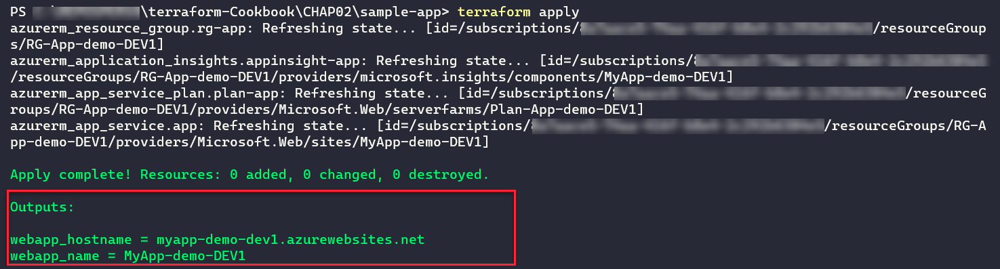
Here, we see two output values that are displayed at the end of the execution.

### There's more…
There are two ways to retrieve the values of the output in order to exploit them, as follows:

By using the terraform output command in the Terraform CLI, which we will see in the Exporting the output in JSON recipe in lab 4, Using the Terraform CLI
By using the terraform_remote_state data source object, which we will discuss in the Using external resources from other state files recipe, later in this lab

### See also
Documentation on Terraform outputs is available at https://www.terraform.io/docs/configuration/outputs.html.

### Provisioning infrastructure in multiple environments
In the same way that we deploy an application to several environments (dev, test, QA, and production), we also need to provision infrastructure on these different environments.

The question that often arises is how to write a maintainable and scalable Terraform configuration that would allow us to provision infrastructure for multiple environments.

To answer this question, it is important to know that there are several solutions for organizing Terraform configuration topologies that will allow for this provisioning.

In this recipe, we will look at two Terraform configuration structure topologies that will allow us to deploy an Azure infrastructure to multiple environments.

### Getting ready
To fully understand this recipe, you will need to have a good understanding of the notion of variables, as discussed in the Manipulating variables recipe of this lab.

The goal of the Terraform configuration that we are going to write is to deploy an Azure App Service for a single environment. Its code is distributed in the following files:
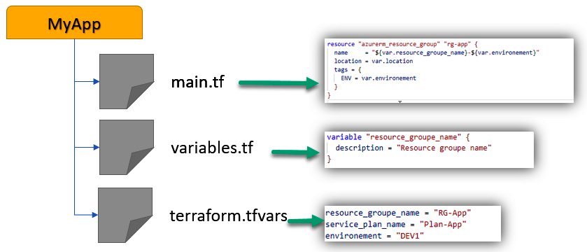

In the preceding diagram, we can see the following:

- The main.tf file contains the Terraform configuration of the resources to be provisioned.
- The variables.tf file contains the declaration of the variables.
- The terraform.tfvars file contains the values of the variables.

The Terraform source code for this basic example is available at https://github.com/PacktPublishing/Terraform-Cookbook/tree/master/CHAP02/myApp/simple-env.

What is important in this recipe is not the content of the code, but the folder structure and the Terraform commands to be executed.

### How to do it…
Follow these steps to implement the first Terraform configuration folder topology:

In an empty folder, create a separate directory per environment: one for dev, one for test, one for QA, and one for production.
Copy the Terraform base configuration into each of these directories identically.
Then, in each of these directories, modify the values of the terraform.tfvars file with the information that is specific to the environment. Here is an extract of each of these terraform.tfvars files:
```
resource_group_name = "RG-App"
service_plan_name = "Plan-App"
environment = "DEV" #name of the environment to change
```
Finally, to provision each of these environments, inside each of these directories, execute the classical Terraform execution workflow by running the terraform init, terraform plan, and terraform apply commands.
Follow these steps to implement the second topology of the Terraform configuration folder:

In the folder that contains our basic Terraform configuration, create three subdirectories: dev, test, and production.
Then, in each of these subdirectories, copy only the terraform.tfvars base file, in which we modify the variables with the correct values of the target environments. The following is an extract from each terraform.tfvars file:
```shell
resource_group_name = "RG-App"
service_plan_name = "Plan-App"
environment = "DEV" #name of the environment to change
```
Finally, to provision each of these environments, go to the root folder of the Terraform configuration and execute the following commands:
```shell

terraform init
terraform plan -var-file="<environment folder>/terraform.tfvars"
terraform apply -var-file="<environment folder>/terraform.tfvars"
```

### How it works…
In the first topology, we duplicate the same Terraform configuration for each environment and just change the values of the variables in the terraform.tfvars file of each folder.

By doing this, we get the following folder structure:
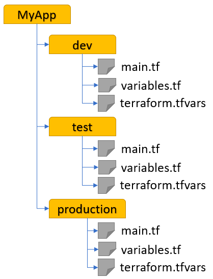

Terraform is then executed with the basic Terraform commands. This structure can be used if the infrastructure does not contain the same resources for each environment. This is because duplicating all the Terraform configuration in each environment folder offers us the advantage of being able to easily add or remove resources for one environment without affecting the other environments.

However, this is duplicate code, which implies that this code must be maintained several times (we must modify the infrastructure for all environments, make changes to the Terraform configuration, and so on).

In the second topology, we kept the Terraform configuration in the common base for all environments and have just one terraform.tfvars file per environment. By doing this, we get the following folder structure:
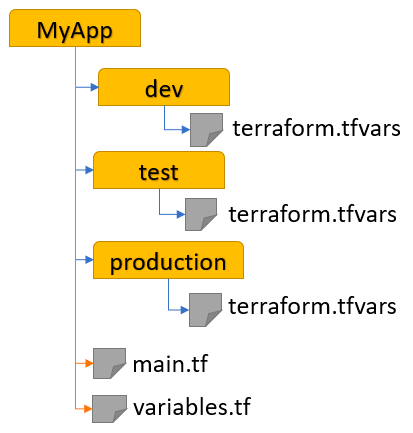

As for the execution of the Terraform configuration, we have added the -var-file option to the plan and apply commands. This structure can be used if the infrastructure is the same for all environments but only the configuration changes.

The advantage of this topology is that we have only one common piece of Terraform resource code (in the main.tf and variables.tf files), and just one terraform.tfvars file to fill in, so we will have to make a few changes in case of code evolution or a new environment.

On the other hand, the changes that were made to the Terraform main.tf code will apply to all the environments, which in this case requires more testing and verification.

### See also
There are other solutions to Terraform configuration folder structure topologies, as we will discuss in lab 5, Sharing Terraform Configuration with Modules.
Documentation regarding the -var-file option of the plan and apply commands is available at https://www.terraform.io/docs/commands/plan.html.
An article explaining the best practices surrounding Terraform configuration can be found at https://www.terraform-best-practices.com/code-structure.
The following blog post explains the folder structure for production Terraform configuration: https://www.hashicorp.com/blog/structuring-hashicorp-terraform-configuration-for-production

## Obtaining external data with data sources
When infrastructure is provisioned with Terraform, it is sometimes necessary to retrieve information about the already existing resources. Indeed, when deploying resources to a certain infrastructure, there is often a need to place ourselves in an existing infrastructure or link it to other resources that have already been provisioned.

In this recipe, we will learn how, in our Terraform configuration, to retrieve information about resources already present in an infrastructure.

### Getting ready
For this recipe, we will use an existing Terraform configuration that provides an Azure App Service in the Azure cloud. This source code is available at https://github.com/PacktPublishing/Terraform-Cookbook/tree/master/CHAP02/data.

This code is incomplete because, for this project, we need to store the App Service in an existing Service Plan. This Service Plan is the one we will use for the entire App Service.

### How to do it…
Perform the following steps:

In our file that contains our Terraform configuration, add the following data block:
```
data "azurerm_app_service_plan" "myplan" {
  name                = "app-service-plan"
  resource_group_name = "rg-service_plan"
}
```
In the properties sections, specify the name and the Resource Group of the Service Plan to be used.

Then, complete the existing App Service configuration, as follows:
```
resource "azurerm_app_service" "app" {
  name                = "${var.app_name}-${var.environement}"
  location            = azurerm_resource_group.rg-app.location
  resource_group_name = azurerm_resource_group.rg-app.name
  app_service_plan_id = data.azurerm_app_service_plan.myplan.id
}
```

### How it works…
In step 1, a data block is added to query existing resources. In this data block, we specify the Resource Group and the name of the existing Service Plan.

In step 2, we use the ID of the Service Plan that was retrieved by the data block we added in step 1.

The result of executing this Terraform configuration can be seen in the following screenshot:

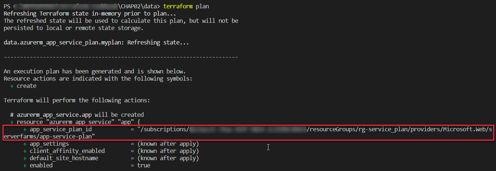
As we can see, we have the ID of the Service Plan that was retrieved by the data block.

### There's more…
What's interesting about the use of data blocks is that when executing the terraform destroy command on our Terraform configuration, Terraform does not perform a destroy action on the resource called by the data block.

Moreover, the use of data blocks is to be preferred to the use of IDs written in clear text in the code, which can change because the data block recovers the information dynamically.

Finally, the data block is also called when executing the terraform plan command, so your external resource must be present before you execute the terraform plan and terraform apply commands.

If this external resource is not already present, we get the following error in the terraform plan command:
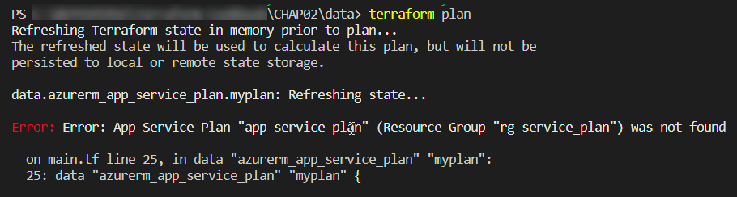

You need to know which providers to use in your Terraform configuration since not all providers implement data blocks.
### See also
For more information about data blocks, take a look at the following documentation: https://www.terraform.io/docs/configuration/data-sources.html

